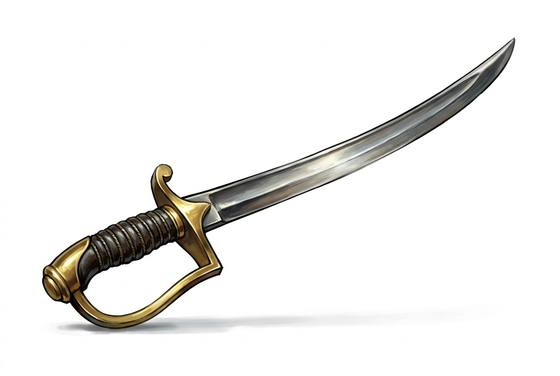

# Sabre

{.illus}

*Set: Expansion*

*aka: ______________________________*

*Era: Iron (needs iron) · Desert and southern kingdoms · Riders and caravans*

A single-edged blade with a gentle curve, a light guard and a grip made for one hand. The curve is the point of it: a straight blade stops when it strikes, but a curved one slides and draws as it cuts, so a rider sweeping past at a canter can open a long wound without the sword being torn from his grip. Caravan guards, desert horsemen and the escorts of southern princes all carry some version of it.

On foot it is quick and forgiving, better at cutting than thrusting, and pleasant to carry on a long journey. It does little against good mail and less against plate, but it was never meant for knights. It was meant for raiders, robbers and the unarmoured, in open country under a hot sun.

## Game block

- **Group:** [Swords](../Weapon_Groups/swords.md) · **Damage:** 1d6+2· **Strength number:** 10
- **Hands:** one · **Weight:** 1.2 kg · **Price:** 60 S
- **Notes:** curved for cutting from the saddle
- **Techniques (from the group):** Half-Swording, Binding the Blade, Draw and Cut
- **Also appears as:** *Riders' Sabre* (Steppe riders); *Desert Scimitar* (Desert and southern kingdoms)

## Not to be confused with

the *[Heavy Sabre](heavy-sabre.md)*, a broader and weightier curved blade that trades the sabre's speed for cuts that can break bone through armour.

