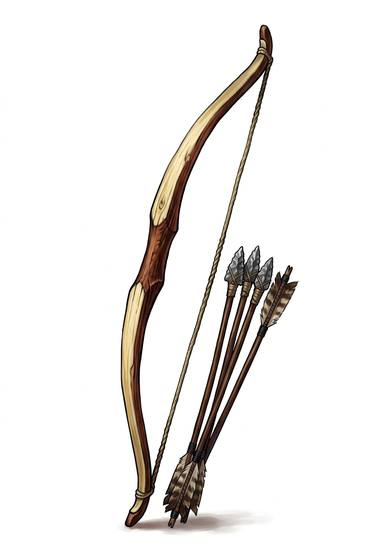

# Self Bow

{.illus}

*Set: Core*

*aka: ______________________________*

*Era: Stone and fire (—) · Hunter peoples · Hunting and skirmish*

A bow made from a single stave of wood, shaped and tapered by hand, strung with sinew or twisted plant fibre. Nothing is glued or joined; the whole weapon is the tree. It is simple in principle and demanding in practice, because a stave carved even slightly wrong will crack at full draw.

The self bow let hunters kill from cover, quietly and again and again, without showing themselves to their prey. A band with good bows ate better and fought harder than one without. The arrows, tipped with stone or bone, fly true enough to take a deer at a fair distance. Damp and cold slacken the wood, so archers keep their bows wrapped and dry.

## Game block

- **Group:** [Bows](../Weapon_Groups/bows.md) · **Damage:** 1d6+1· **Strength number:** 9
- **Hands:** two · **Range (m):** 5/20/40/80/150 · **Reload:** every round · **Weight:** 0.8 kg · **Price:** 5 S
- **Notes:** one piece of wood
- **Techniques (from the group):** Rapid Volley, Arcing Shot, Shot on the Move

## Not to be confused with

the *[Composite Bow](composite-bow.md)*, made of horn, wood and sinew glued together: shorter, stronger and much harder to build.

