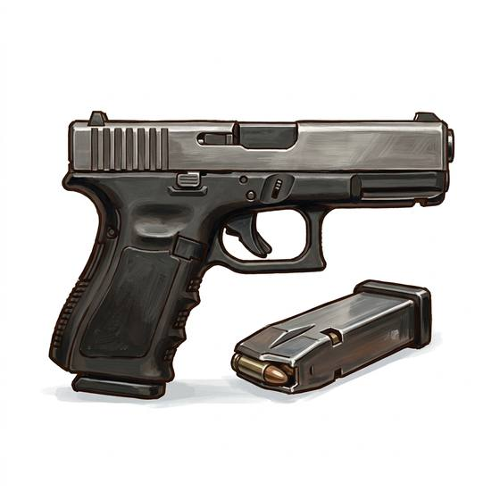

# Semi-Automatic Pistol

{.illus}

*Set: Core*

*aka: ______________________________*

*Era: Electricity (needs electricity) · Modern armies and police*

A flat, angular handgun that loads itself. The energy of each shot drives the slide back to throw out the empty case and strip a new round from the magazine in the grip, so the shooter only has to keep pulling the trigger. When the magazine runs dry, it drops out and a fresh one slides in within a heartbeat.

It is the sidearm of police officers, soldiers, security guards and criminals the modern world over. Easy to carry, easy to reload, accurate enough across a room or a car park. Its owners fuss over cleaning and practise drawing it until the movement is thoughtless. Most will never fire it in anger, and those who do rarely remember how many times they pulled the trigger.

## Game block

- **Group:** [Handguns](../Weapon_Groups/handguns.md) · **Damage:** 1d6+1· **Strength number:** 7
- **Hands:** one · **Range (m):** 5/15/30/50/100 · **Reload:** 15 shots, 1 round · **Weight:** 0.9 kg · **Price:** 4 S
- **Techniques (from the group):** Quick Draw, Two-Gun Fire, Fan the Hammer
- **Also appears as:** *Frontier Sidearm* (Frontier settlers and smugglers)

## Not to be confused with

the *[Revolver](revolver.md)*, the older handgun whose turning cylinder holds fewer shots and must be reloaded one chamber at a time.

