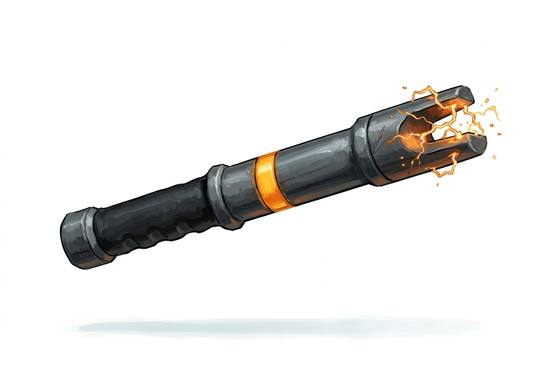

# Shock Baton

{.illus}

*Set: Expansion*

*aka: ______________________________*

*Era: Spaceflight (needs spaceflight) · Star navies and marines*

A short rod with an insulated grip and an electrified tip, carried by ship's police, prison guards and naval boarding teams. One touch sends a jolt through the body that locks the muscles and drops the target. It is made for crowded places where a stray shot could hole a hull or kill a bystander, and for prisoners who are wanted alive.

It also works as an ordinary club when the charge runs out. The best of them have a glowing indicator that tells everyone nearby it is live, which calms many situations on its own. Crews on long voyages have grim jokes about it, and the ones who carry it often end up with a reputation for using it too freely.

## Game block

- **Group:** [Axes, Maces & Clubs](../Weapon_Groups/axes-maces-and-clubs.md) · **Damage:** 1d6· **Strength number:** 6
- **Hands:** one · **Weight:** 0.8 kg · **Price:** 2 S
- **Notes:** stuns like a stun gun on a hit
- **Techniques (from the group):** Hook the Shield, Bone-Breaker

## Not to be confused with

the *[Baton](baton.md)*, the older unpowered stick that only bruises.

