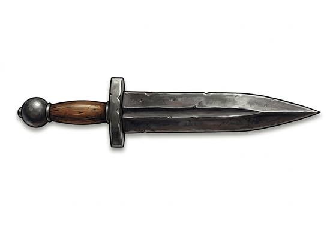

# Short Stabbing Sword

{.illus}

*Set: Expansion*

*aka: ______________________________*

*Era: Iron (needs iron) · Mediterranean empire · Legion drill*

A short, broad iron blade with a long, tapering point and a solid grip. It is not an elegant weapon; it is a tool of drill. The soldiers who carry it fight from behind large curved shields, packed tight, and they are taught to stab low and hard through the gaps between shields, then take a half step forward and do it again.

It thrusts rather than slashes, because a thrust needs little room and a stab to the belly kills where a cut only wounds. The empire that armed its legions with it conquered half the known world with a sword barely longer than a forearm, and made the name of its infantry a thing to be feared by any tribe that saw them marching.

## Game block

- **Group:** [Swords](../Weapon_Groups/swords.md) · **Damage:** 1d6+1· **Strength number:** 9
- **Hands:** one · **Weight:** 1 kg · **Price:** 40 S
- **Notes:** made to thrust from behind a big shield
- **Techniques (from the group):** Half-Swording, Binding the Blade, Draw and Cut

## Not to be confused with

the *[Leaf-Blade Sword](leaf-blade-sword.md)*, an earlier bronze sidearm made for cutting as well as thrusting.

