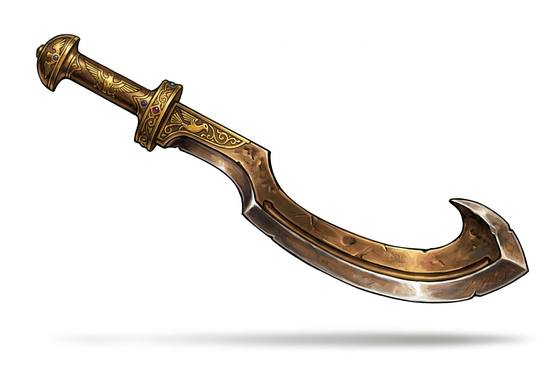

# Sickle Sword

{.illus}

*Set: Core*

*aka: ______________________________*

*Era: Bronze (needs bronze) · River kingdoms and chariot peoples · Chariot war*

A bronze blade that runs straight from the grip and then bends into a long, outward curve, like a reaping hook grown into a sword. The edge is on the outside of the curve. It is the weapon of chariot nobles and palace guards, heavy at the tip and made to chop from above.

Its hook is its trick. A warrior can reach over the rim of an enemy's shield and drag it aside, opening the bearer to a second blow. It is less useful for thrusting, and the soft bronze needs regular care to keep an edge. Kings are shown in carvings holding one over kneeling enemies, and the shape became a sign of royal power long after better swords existed.

## Game block

- **Group:** [Swords](../Weapon_Groups/swords.md) · **Damage:** 1d6+1· **Strength number:** 10
- **Hands:** one · **Weight:** 1.2 kg · **Price:** 50 S
- **Notes:** the hooked blade drags shields aside
- **Techniques (from the group):** Half-Swording, Binding the Blade, Draw and Cut

## Not to be confused with

the *[Leaf-Blade Sword](leaf-blade-sword.md)*, a straight bronze sword built to thrust rather than hook and chop.

