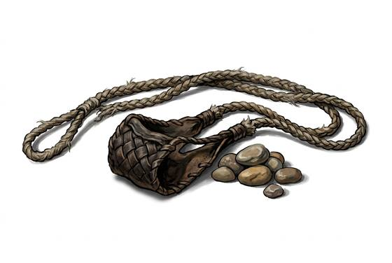

# Sling

{.illus}

*Set: Core*

*aka: ______________________________*

*Era: Stone and fire (—) · Hunter peoples · Hunting and skirmish*

Two cords and a small pouch, woven from wool, hair or plant fibre. A stone goes in the pouch, the slinger whirls it once or twice and lets one cord go, and the stone flies faster than an arrow. It weighs almost nothing, folds into a pocket and uses ammunition that lies on every riverbank.

Shepherds carry slings to drive off wolves, and in their long idle hours on the hills they grow terrifyingly accurate. Armies have hired whole villages of slingers. A stone doesn't pierce armour, but it bruises through it, and a stone to the head knocks a man flat whatever he wears. Shaped lead or clay shot flies farther and hits harder still.

## Game block

- **Group:** [Slings](../Weapon_Groups/slings.md) · **Damage:** 1d4· **Strength number:** 6
- **Hands:** one · **Range (m):** 5/20/40/80/150 · **Reload:** every round · **Weight:** 0.2 kg · **Price:** 3 C
- **Notes:** stones are free
- **Techniques (from the group):** Stunning Stone, Slinger's Rhythm

## Not to be confused with

the *[Sling-Mace](sling-mace.md)*, a stone on a cord swung by hand in close combat and never let go.

