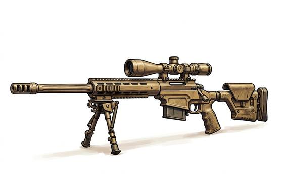

# Sniper Rifle

{.illus}

*Set: Expansion*

*aka: ______________________________*

*Era: Electricity (needs electricity) · Modern armies and police*

A precise, heavy rifle fitted with a telescopic sight, a smooth trigger and a barrel built to put shot after shot into the same small circle at distances where the target is only a speck. The sniper and their spotter lie hidden for hours, sometimes days, reading the wind in the grass and the shimmer of the air, waiting for one shot.

It is a weapon of patience and of fear. A single rifle in the right place can pin down a company, silence its officers and make every soldier on the other side afraid to raise their head. Snipers are admired by their own side and loathed by the enemy, and those who are captured are often treated worse than any other prisoner.

## Game block

- **Group:** [Long Guns](../Weapon_Groups/long-guns.md) · **Damage:** 2d6+2· **Strength number:** 10
- **Hands:** two · **Range (m):** 10/200/600/1,000/1,500 · **Reload:** 5 shots, 1 round · **Weight:** 7 kg · **Price:** 30 S
- **Notes:** with a scope, halve long and extreme penalties
- **Techniques (from the group):** Aimed Shot, Snap Shot, Wall of Shot

## Not to be confused with

the *[Bolt-Action Rifle](bolt-action-rifle.md)*, the ordinary infantry rifle from which the sniper's weapon grew, lacking its scope and fine accuracy.

