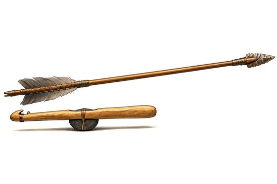

# Spear-Thrower and Dart

{.illus}

*Set: Core*

*aka: ______________________________*

*Era: Stone and fire (—) · Hunter peoples · Hunting and skirmish*

A short, flat stick with a hook or spur at one end, and a long, light dart that sits against the hook. The hunter holds both, then whips the thrower forward like an extra length of arm, and the dart leaves far faster and farther than a hand alone could send it. It is one of the cleverest ideas the stone age ever had.

The darts are slender and fletched, the throwers often carved with animals or marks of ownership. A skilled hunter can drop large game at a distance that seems impossible to anyone who has only thrown by hand. It takes practice to aim well, and a dart needs open space to fly, but in grassland or on the shore it rules the hunt until the bow arrives.

## Game block

- **Group:** [Thrown Weapons](../Weapon_Groups/thrown-weapons.md) · **Damage:** 1d6+1· **Strength number:** 8
- **Hands:** one · **Range (m):** 5/20/40/60/100 · **Reload:** every round · **Weight:** 1 kg · **Price:** 2 S
- **Notes:** the thrower lengthens the arm
- **Techniques (from the group):** Draw and Throw, Pinning Throw, Grenade Cook
- **Also appears as:** *Jungle Spear-Thrower* (Jungle and highland empires)

## Not to be confused with

the *[Self Bow](self-bow.md)*, which shoots smaller arrows with more accuracy and a steadier aim, but is harder to make.

