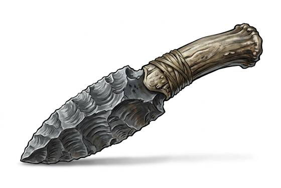

# Stone Knife

{.illus}

*Set: Core*

*aka: ______________________________*

*Era: Stone and fire (—) · Hunter peoples · Hunting and skirmish*

A blade knapped from flint, chert or glassy volcanic stone, bound with sinew to a handle of bone or wood. The edge is sharper than any steel, and it chips if it meets anything harder than meat. Every member of a hunting band carries one. It skins, butchers, cuts cord, scrapes hides, shapes wood and, when it must, opens a throat.

A stone knife is a tool first and a weapon second. In a fight it is short and brittle, useless against anything tougher than hide, and a broken tip in a wound is the worst outcome for everyone. Its makers are respected: shaping a good blade from a core of stone takes skill that few learn well.

## Game block

- **Group:** [Knives & Daggers](../Weapon_Groups/knives-and-daggers.md) · **Damage:** 1d4· **Strength number:** 5
- **Hands:** one · **Weight:** 0.3 kg · **Price:** 1 S
- **Techniques (from the group):** Inside the Guard, Through the Gap, Concealed Draw

## Not to be confused with

the *[Military Dagger](military-dagger.md)*, an iron blade made for fighting that won't shatter on a rib.

