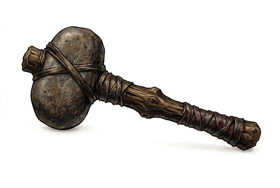

# Stone Mace

{.illus}

*Set: Expansion*

*aka: ______________________________*

*Era: Bronze (needs bronze) · River kingdoms and chariot peoples · Chariot war*

A ball or pear of hard stone, ground smooth and drilled through, mounted on a wooden handle. It takes days of patient grinding to make, and it is heavier and harder than any club. It crushes skulls, and early kings used it in carvings as the sign of their power over the conquered.

It is a weapon for breaking bones rather than cutting flesh, and it cares little for leather or woven armour. A good stone head will outlast the handle many times over. Its weakness is its weight, which makes it slow to recover after a missed blow, and its fragility: a stone head that strikes another stone head may crack.

## Game block

- **Group:** [Axes, Maces & Clubs](../Weapon_Groups/axes-maces-and-clubs.md) · **Damage:** 1d6+2· **Strength number:** 11
- **Hands:** one · **Weight:** 2 kg · **Price:** 5 S
- **Techniques (from the group):** Hook the Shield, Bone-Breaker

## Not to be confused with

the *[Wooden Club](wooden-club.md)*, which is lighter, cheaper and much quicker to make, but hits with less weight.

