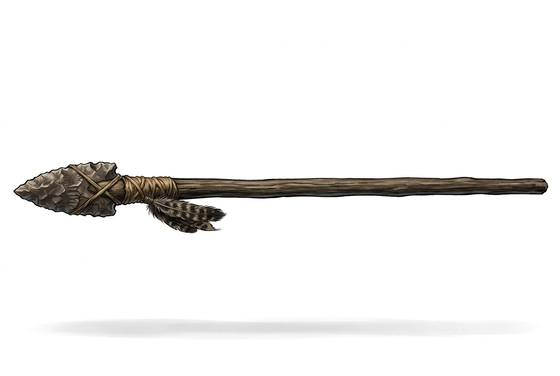

# Stone-Tipped Spear

{.illus}

*Set: Core*

*aka: ______________________________*

*Era: Stone and fire (—) · Hunter peoples · Hunting and skirmish*

A straight shaft of wood with a knapped stone point bound into a split at one end. It is the hunter's great weapon: long enough to keep a wounded beast at bay, light enough to throw, and simple enough that a lost one can be remade by nightfall. Whole bands hunt together with them, surrounding herds or driving game over cliffs.

Held in both hands it thrusts deep. Held in one it can be thrown a short way, though a thrown spear is a spear the hunter no longer has. The stone point is sharp but fragile, and a broken tip means a return to the knapping stones. Against men in hide or fur it is as deadly as it is against deer.

## Game block

- **Group:** [Spears](../Weapon_Groups/spears.md) · **Damage:** 1d6+1· **Strength number:** 9
- **Hands:** one or two · **Range (m):** 2/8/15/20/30 thrown · **Weight:** 2 kg · **Price:** 2 S
- **Notes:** can be thrown
- **Techniques (from the group):** Keep at Bay, Set Against the Charge, Shaft Sweep

## Not to be confused with

the *[Thrusting Spear](thrusting-spear.md)*, a bronze-headed spear made for fighting in a shield line rather than for the hunt.

