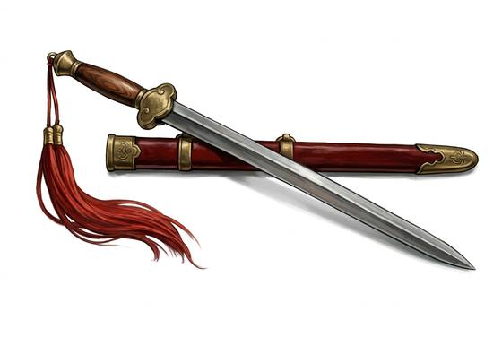

# Straight Scholar's Sword

{.illus}

*Set: Expansion*

*aka: ______________________________*

*Era: Iron (needs iron) · Eastern empire · Imperial armies*

A slim, straight, double-edged blade with a small guard and a long tassel hanging from the pommel. It is light, quick and precise, and its lineage stretches back to the earliest swords of the eastern empire. Officials, scholars and gentlemen wear it as a sign of learning and self-mastery as much as martial skill.

It is a sword of flow and finesse. Its schools teach deflection, circling steps, quick cuts to the wrist and precise thrusts, all smoothly joined. It is too light to trade blows with a heavy blade or to cut through armour, so its masters avoid force altogether. Poets write about it, painters paint it, and it hangs on the wall of any household that wishes to seem refined.

## Game block

- **Group:** [Fencing Blades](../Weapon_Groups/fencing-blades.md) · **Damage:** 1d6+1· **Strength number:** 8
- **Hands:** one · **Weight:** 0.8 kg · **Price:** 80 S
- **Notes:** light and quick; a gentleman's blade
- **Techniques (from the group):** Lunge, Feint in Time, Riposte

## Not to be confused with

the *[Heavy Sabre](heavy-sabre.md)*, the soldier's curved sword of the same empire, built to chop rather than to flow.

