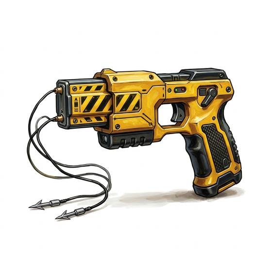

# Stun Gun

{.illus}

*Set: Expansion*

*aka: ______________________________*

*Era: Electricity (needs electricity) · Modern armies and police*

A handgun that fires two small barbed darts trailing thin wires. When they strike, a pulse of electricity runs between them and locks the target's muscles, dropping them to the ground twitching and helpless for a little while. It is the weapon of police and guards who want to stop someone without shooting them.

It has a short reach and a single shot before it must be reloaded. The darts must both lodge in skin or thin clothing: a heavy coat or armour stops them cold. Victims describe it as the worst thing they have ever felt, and then describe getting up afterwards largely unharmed. It is less gentle than its sellers claim, and much gentler than a bullet.

## Game block

- **Group:** [Handguns](../Weapon_Groups/handguns.md) · **Damage:** 1d6· **Strength number:** 5
- **Hands:** one · **Range (m):** 2/5/7/10/— · **Reload:** 1 shot, 1 round · **Weight:** 0.3 kg · **Price:** 1 S
- **Notes:** a hit forces a END check or the target drops for 1d6 rounds; no effect through heavy armour
- **Techniques (from the group):** Quick Draw, Two-Gun Fire, Fan the Hammer

## Not to be confused with

the *[Shock Baton](shock-baton.md)*, a club that delivers a similar shock but only by touch, at arm's length.

