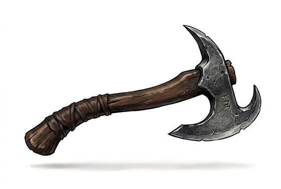

# Throwing Axe

{.illus}

*Set: Expansion*

*aka: ______________________________*

*Era: Iron (needs iron) · Northern tribes · Raiding and shield wall*

A small, light axe with a short haft and a heavy, curved head, balanced to spin end over end through the air. Warriors of the northern tribes carry several, hurled in a volley just before a charge to break the enemy's shields and nerve.

Thrown well, it bites deep into a shield or a skull. Thrown badly, it clatters harmlessly off, and now the enemy has it. It can be used in the hand as well, which makes it a practical choice for warriors who can't be sure how the fight will go. The skill of the throw is judging distance so that the edge, not the haft, arrives first.

## Game block

- **Group:** [Thrown Weapons](../Weapon_Groups/thrown-weapons.md) · **Damage:** 1d6+1· **Strength number:** 9
- **Hands:** one · **Range (m):** 2/5/10/15/20 · **Reload:** every round · **Weight:** 0.8 kg · **Price:** 8 S
- **Techniques (from the group):** Draw and Throw, Pinning Throw, Grenade Cook

## Not to be confused with

the *[Heavy Javelin](heavy-javelin.md)*, a thrown weapon built to pierce; the axe is thrown to cut and stagger.

