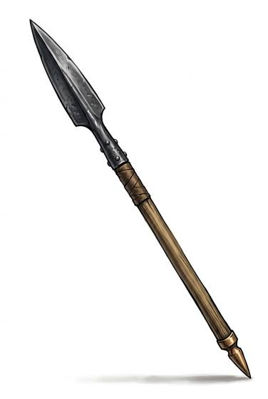

# Thrusting Spear

{.illus}

*Set: Core*

*aka: ______________________________*

*Era: Bronze (needs bronze) · Sea peoples and city-states · Shield line*

A long ash shaft with a leaf-shaped bronze head at one end and often a spike at the other, so that a broken spear still has a point. It is the weapon of citizen soldiers who stand shoulder to shoulder behind overlapping shields, each man protecting his neighbour. The line pushes, and the spears reach over the shields and down into the enemy.

It is used in one hand, overhand or underhand, with the shield on the other arm. Drill matters more than strength: a line that holds together wins, a line that breaks dies. The spear is cheap to make and easy to learn, which is why every city with walls and citizens eventually picks one up.

## Game block

- **Group:** [Spears](../Weapon_Groups/spears.md) · **Damage:** 1d6+2· **Strength number:** 10
- **Hands:** one · **Range (m):** 2/8/15/20/30 thrown · **Weight:** 2 kg · **Price:** 5 S
- **Notes:** the weapon of the shield wall
- **Techniques (from the group):** Keep at Bay, Set Against the Charge, Shaft Sweep
- **Also appears as:** *City-State Spear* (Sea peoples and city-states); *Northern Spear* (Northern tribes)

## Not to be confused with

the *[Pike](pike.md)*, a far longer spear held in both hands and used in deep blocks without shields.

