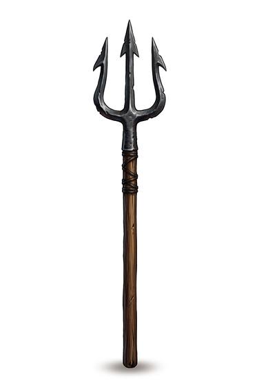

# Trident

{.illus}

*Set: Expansion*

*aka: ______________________________*

*Era: Iron (needs iron) · Arena · Spectacle*

A three-pronged spear, born as a fishing tool and turned into a weapon for the arena, where it is paired with a net and carried by a fighter who wears almost no armour. Crowds love it because it promises something slower and crueller than a clean kill: the net goes out, the prongs come after, and the struggle is long enough to watch.

The prongs make it more than a spear. They catch an incoming blade between them and hold it for a heartbeat, long enough to twist it aside or wrench it from the hand. They also make it clumsy against a shield, and the three points share the weight of the thrust, so it wounds shallow where a single point would go deep. Fishermen still use it for what it was first made for.

## Game block

- **Group:** [Spears](../Weapon_Groups/spears.md) · **Damage:** 1d6+1· **Strength number:** 9
- **Hands:** one or two · **Weight:** 2 kg · **Price:** 10 S
- **Notes:** +1 to Parry against blades (it catches them)
- **Techniques (from the group):** Keep at Bay, Set Against the Charge, Shaft Sweep

## Not to be confused with

the *[Thrusting Spear](thrusting-spear.md)*, a single broad point that goes deeper but can't catch a blade between its tines.

