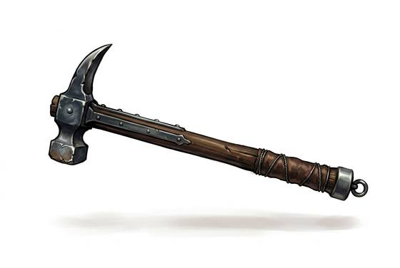

# War Hammer

{.illus}

*Set: Expansion*

*aka: ______________________________*

*Era: Iron (needs iron) · Western kingdoms · Knightly and common warfare*

A short or long haft topped with a small, heavy head: a flat or toothed hammer face on one side and a curved spike or beak on the other. It is a weapon for fighting men in plate. The hammer face stuns through a helmet; the beak punches a hole in armour and the flesh behind it.

It is more precise than a mace and less showy than a sword. Knights on foot use the long version in both hands, levering, hooking and driving, and on horseback the short one in a single hand. A well-trained fighter can use the beak to hook a leg, drag down a shield or pull a rider from the saddle.

## Game block

- **Group:** [Great Weapons](../Weapon_Groups/great-weapons.md) · **Damage:** 1d6+2· **Strength number:** 12
- **Hands:** one or two · **Weight:** 1.5 kg · **Price:** 30 S
- **Notes:** a beak on one side, a hammer on the other
- **Techniques (from the group):** Overhead Smash, Shattering Blow, Haft Guard

## Not to be confused with

the *[Heavy tool (hammer, pick, crowbar)](heavy-tool-hammer-pick-crowbar.md)*, a worker's tool that works in a pinch but lacks the balance and reach.

