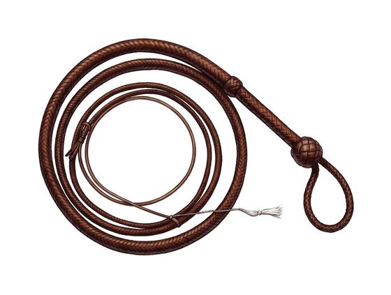

# Whip

{.illus}

*Set: Expansion*

*aka: ______________________________*

*Era: Iron (needs iron) · Arena · Spectacle*

A long, tapering lash of plaited leather on a short stiff handle. When the tip breaks the sound barrier it cracks like a pistol, and that crack has kept cattle, slaves and crowds in line for thousands of years. In the arena it is a showpiece, all noise and flourish and a sudden red line across bare skin.

As a weapon it is honest about its limits. It stings, cuts and frightens, but anything thicker than a coat stops it cold. Its real use is the trick: the lash wraps a wrist and pulls a blade away, or wraps an ankle and brings a man down. A good whip-handler controls the space around them, and keeps foes at a distance that feels safe until it isn't.

## Game block

- **Group:** [Whips](../Weapon_Groups/whips.md) · **Damage:** 1d6−1· **Strength number:** 6
- **Hands:** one · **Range (m):** reach 3 m · **Weight:** 1 kg · **Price:** 3 S
- **Notes:** never beats real armour; can disarm or trip
- **Techniques (from the group):** Lash and Snare, Crack of Warning, Flick to the Eyes

## Not to be confused with

the *[Lasso](lasso.md)*, a loop of rope thrown to catch and hold, which doesn't cut or crack at all.

